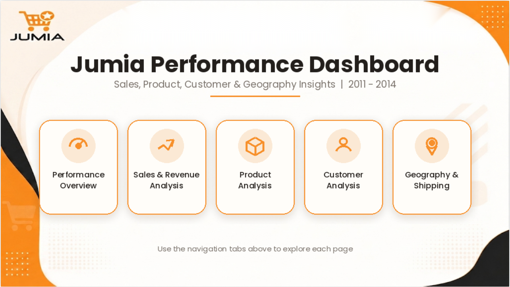

# 🛒 Jumia Sales Performance Dashboard

An interactive **Power BI dashboard** designed to analyze Jumia's sales performance, revenue, products, customers, geography, and shipping operations.

## 📊 Project Overview

This project provides a comprehensive analysis of sales data using **Microsoft Power BI**, transforming raw data into interactive dashboards and actionable business insights.

The dashboard helps stakeholders monitor performance, identify sales trends, understand customer behavior, and evaluate product and geographic performance.

## 🎯 Business Objectives

- Analyze overall sales and revenue performance
- Identify top-performing products and categories
- Understand customer purchasing behavior
- Analyze sales performance across different regions
- Evaluate shipping performance
- Identify trends and patterns to support business decisions

## 📌 Dashboard Pages

### 1. Introduction
Provides an overview of the project, objectives, and dashboard structure.

### 2. Performance Overview
Highlights the main KPIs and overall business performance.

### 3. Sales & Revenue Analysis
Analyzes sales trends, revenue performance, and key sales metrics.

### 4. Product Analysis
Provides insights into product performance and identifies top-performing products.

### 5. Customer Analysis
Analyzes customer behavior and purchasing patterns.

### 6. Geography & Shipping
Analyzes geographic performance and shipping-related metrics.

## 💡 Key Insights

- The dashboard generated approximately **$10M in total revenue** and **$2M in total profit**, with an overall **18% profit margin**.

- Revenue showed strong growth toward the end of the period, reaching its highest monthly value in **December ($1.57M)**, followed by **November ($1.48M)** and **September ($1.30M)**.

- **West** was the highest-performing region, generating **$3.4M in revenue** and approximately **$0.6M in total profit**, followed by East with $2.7M in revenue.

- **Technology** generated the highest revenue among the three main categories at **$245K**, followed by Office Supplies ($187K) and Furniture ($18K).

- **Chairs ($1.42M)** and **Phones ($1.38M)** were the top revenue-generating sub-categories, followed by Storage ($1.04M) and Tables ($0.90M).

- Discounting had a significant impact on profitability. Products with **30%+ discounts recorded a negative 37% profit margin**, compared with **29% for products with no discount**.

- The business served **793 customers**, with **Consumer customers representing the largest segment at 52%**, followed by Corporate (30%) and Home Office (19%).

- **Standard Class** was the most frequently used shipping method, accounting for **60% of orders**, while Same Day represented only **5%**.

- The product analysis identified **Canon Imageclass 2200 Advanced Copier** as a strong performer, generating approximately **$99K in profit** and **$231K in revenue**.

- The dashboard recorded approximately **5K orders**, with an **Average Order Value (AOV) of $2K** and approximately **38K units sold**.

## 🛠️ Tools & Technologies

- **Microsoft Power BI**
- **Power Query**
- **DAX**
- **Data Modeling**
- **Data Visualization**

## 📷 Dashboard Preview

### Introduction

### Performance Overview

### Sales & Revenue Analysis

### Product Analysis

### Customer Analysis

### Geography & Shipping

- `jumia project-.pbix` — Power BI dashboard
- `Screenshots/` — Dashboard screenshots

## 💡 Key Skills Demonstrated

- Data Cleaning & Transformation
- Data Modeling
- DAX Measures
- KPI Development
- Interactive Dashboard Design
- Business Analysis
- Data Visualization

## 👩‍💻 Author

**Eman Elshafei**

[LinkedIn](https://www.linkedin.com/) • [GitHub](https://github.com/)
